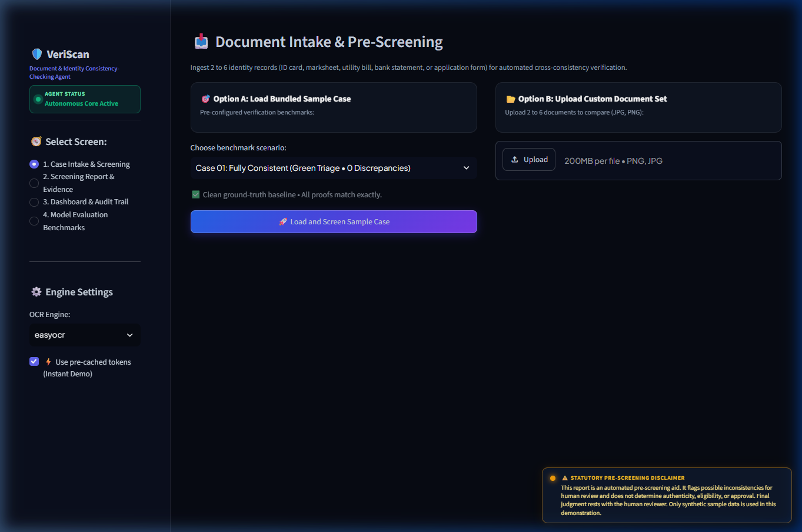
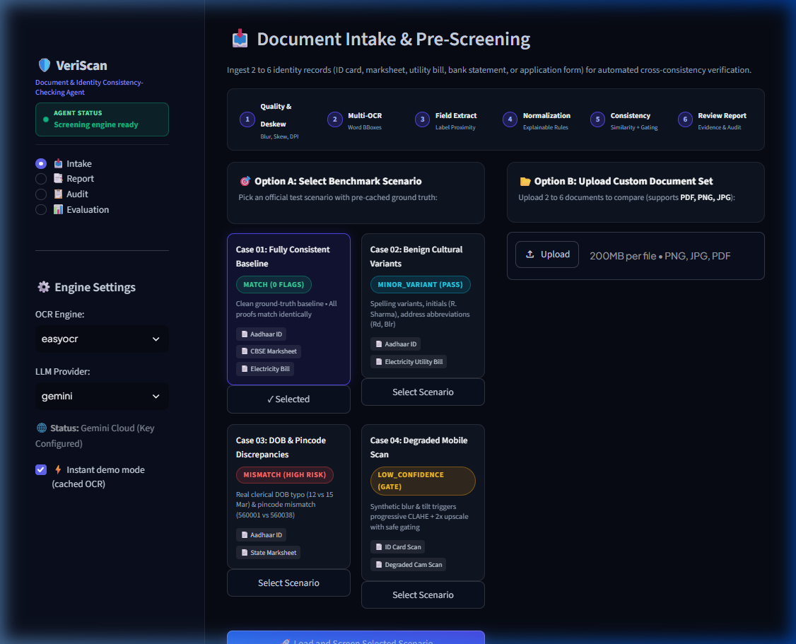
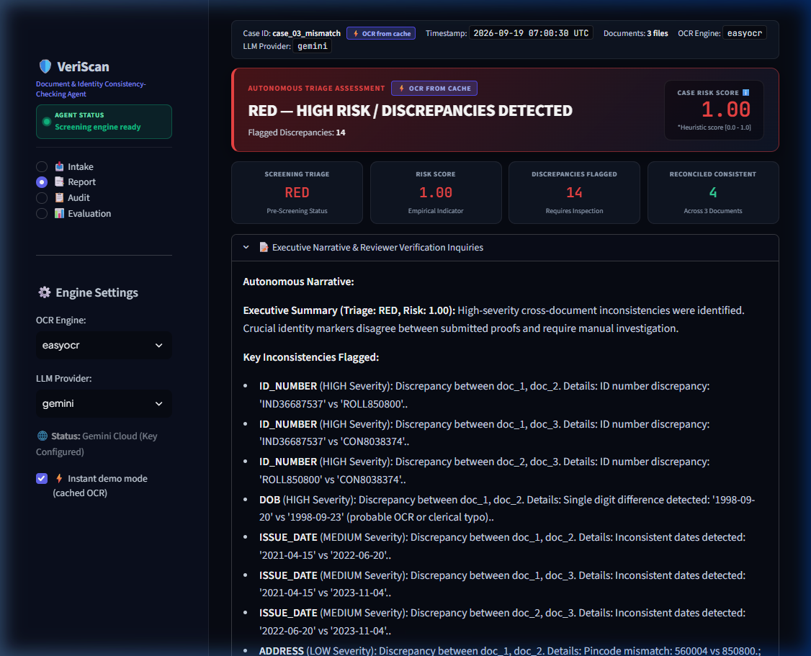
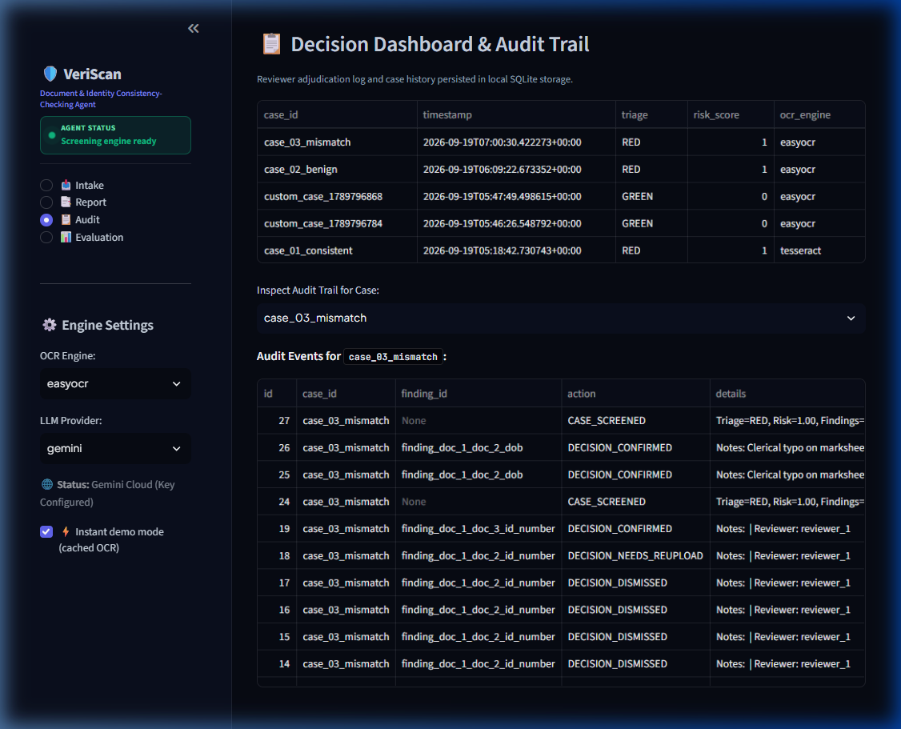
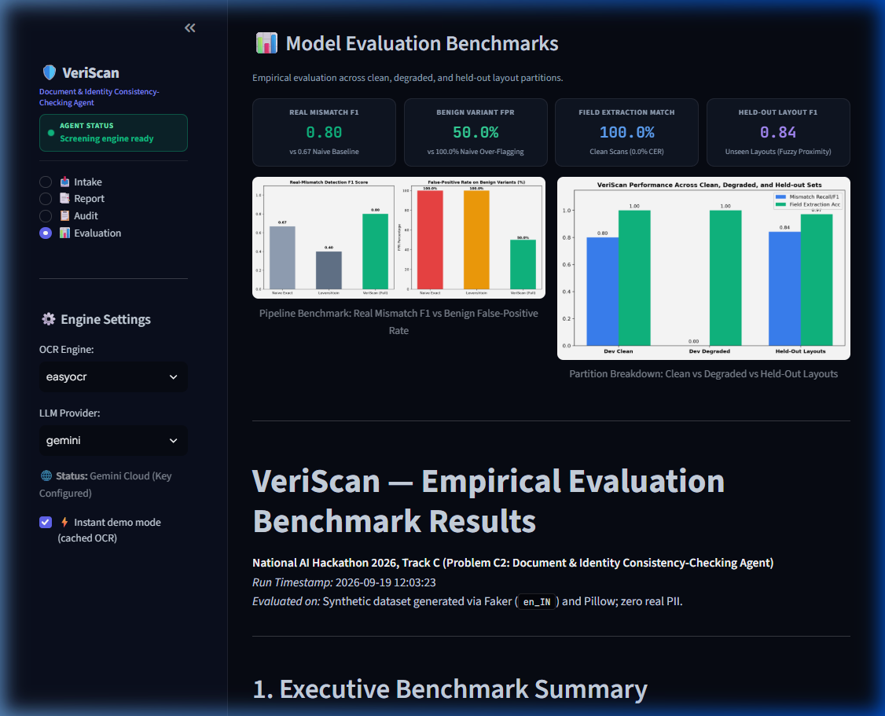
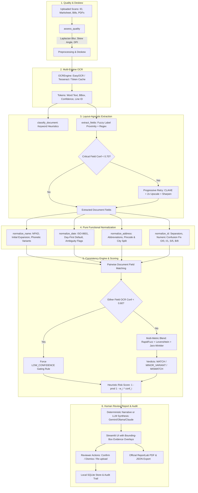

# VeriScan — Document & Identity Consistency-Checking Agent
### Autonomous Multi-Document Pre-Screening & Reconciliation System
**National AI Hackathon 2026 | Track C: Autonomous Agents (Problem C2)**

> **⚖️ SCREENING AID, HUMAN REVIEW REQUIRED:**  
> **This report is an automated pre-screening aid. It flags possible inconsistencies for human review and does not determine authenticity, eligibility, or approval. Final judgment rests with the human reviewer. Only synthetic sample data is used in this demonstration.**

---

## 📸 Visual UI Tour (Before & After Polish)

### Before UI Polish
*Previous state with floating banner and raw dropdown:*  


---

### 1. 📥 Intake Screen — 6-Stage Pipeline & 4 Selectable Scenarios
*Visual 6-stage workflow strip, 4 rich benchmark cards, and multi-file drag-drop supporting PDF, PNG, and JPG:*  


---

### 2. 📑 Report Screen — Evidence Visualizer & Bounding Boxes
*FR7 Header metadata, triage rating, side-by-side raw/normalized comparisons, and interactive bounding boxes:*  


---

### 3. 📋 Audit Trail — Human-in-the-Loop Decisions
*Immutable SQLite audit log recording reviewer status (Confirmed, Dismissed, Re-upload), notes, and timestamps:*  


---

### 4. 📊 Evaluation Screen — Empirical Benchmarks & Charts
*Scientific 3-way pipeline comparison (Naive vs Levenshtein vs VeriScan) across clean, degraded, and held-out partitions:*  


---

## 📑 Table of Contents
1. [Executive Summary — What Exactly is VeriScan Doing?](#1-executive-summary--what-exactly-is-veriscan-doing)
2. [The Problem & Business Context](#2-the-problem--business-context)
3. [System Architecture & 6-Stage Pipeline](#3-system-architecture--6-stage-pipeline)
4. [OCR Configuration Guide (Tesseract, EasyOCR & Cache)](#4-ocr-configuration-guide-tesseract-easyocr--cache)
5. [LLM Provider & API Keys Configuration](#5-llm-provider--api-keys-configuration)
6. [Quickstart in 3 Terminal Commands](#6-quickstart-in-3-terminal-commands)
7. [Demonstration Scenarios (Bundled & Custom Documents)](#7-demonstration-scenarios-bundled--custom-documents)
8. [C2 Compliance & Deliverables Contract Matrix](#8-c2-compliance--deliverables-contract-matrix)
9. [Empirical Evaluation Benchmarks](#9-empirical-evaluation-benchmarks)
10. [Honest Limitations & Ethical Boundaries](#10-honest-limitations--ethical-boundaries)

---

## 1. Executive Summary — What Exactly is VeriScan Doing?

In university admissions, banking loan underwriting, and government welfare scheme enrollments, applicants submit **2 to 6 different supporting documents** (such as an ID card, academic marksheet, utility bill, bank statement, or application form).

Human verification officers manually compare identity markers (Name, Date of Birth, Address, ID numbers) across every proof. This manual process suffers from two critical flaws:
1. **Fatigue & Late-Queue Oversights:** Reviewers processing hundreds of files miss subtle but critical discrepancies (e.g. DOB `12/03/2004` on an ID card vs `15/03/2004` on a marksheet).
2. **False Alarms on Benign Variations:** Standard computerized search engines flag harmless cultural variations as errors (e.g. `R. Sharma` vs `Rohit Sharma`, `MG Rd, Blr` vs `Mahatma Gandhi Road, Bengaluru`, or `Mohd` vs `Mohammed`), wasting up to 70% of reviewer time.

### The Solution:
**VeriScan is an autonomous pre-screening agent that ingests multi-document sets, extracts key fields using layout-agnostic OCR, normalizes cross-cultural formatting variants with an explainable rule trace, isolates genuine discrepancies, and hands the human reviewer a ranked, evidence-backed report with visual bounding-box overlays.**

It acts as an **intelligent screening assistant, never a verdict** — highlighting precisely where human adjudicators need to look.

---

## 2. The Problem & Business Context

| User Persona | Core Challenge | How VeriScan Solves It |
|---|---|---|
| **Human Reviewer (Adjudicator)** | Exhausted by manually cross-checking hundreds of documents; overwhelmed by false alarms on initials, abbreviations, and date formats. | Delivers a ranked issue list with visual bounding-box highlights on the actual scan in under **1 second**. Relegates harmless variations to a transparent *"Checked & Consistent"* list. |
| **Operations Supervisor** | Lacks visibility into reviewer decisions; faces inconsistent verification standards across team members. | Maintains an immutable SQLite audit log of every case, recording reviewer decisions (`CONFIRMED`, `DISMISSED`, `NEEDS_REUPLOAD`), notes, and timestamps. |

---

## 3. System Architecture & 6-Stage Pipeline



---

## 4. OCR Configuration Guide (Tesseract, EasyOCR & Cache)

VeriScan features a pluggable, dual-engine OCR architecture with an intelligent pre-cached demo mode:

### A. Dual Engine Comparison

| Feature | EasyOCR Engine | Tesseract OCR Engine | Pre-Cached Demo Mode |
|---|---|---|---|
| **Architecture** | Deep learning CRAFT text detector + CRNN recognizer | Classical OCR engine + LSTM line recognizer | Pre-extracted word token bounding boxes (`*_tokens.json`) |
| **Dependencies** | Self-contained Python wheels (`torch`, `easyocr`) | Requires external OS system binary (`tesseract.exe`) | Zero external dependencies, pure JSON parsing |
| **Setup Time** | Pre-downloads ~50MB PyTorch weights on first run | Requires OS package installation or PATH setup | **Instant (0.00s)** |
| **Best For** | Camera photos, varied Indian fonts, rotation | Clean printed documents, server batch queues | **Live judge demonstrations & offline air-gapped environments** |

### B. Configuring Tesseract on Your Machine

1. **Windows Installation:**
   - Download the official installer from: [UB-Mannheim Tesseract Releases](https://github.com/UB-Mannheim/tesseract/wiki).
   - Default install path: `C:\Program Files\Tesseract-OCR\tesseract.exe`.
   - Add to your system `PATH`, or specify in your `.env` file:
     ```bash
     TESSERACT_CMD=C:\Program Files\Tesseract-OCR\tesseract.exe
     ```

2. **Ubuntu / Debian Installation:**
   ```bash
   sudo apt-get update && sudo apt-get install -y tesseract-ocr
   ```

3. **macOS Installation:**
   ```bash
   brew install tesseract
   ```

### C. Configuring EasyOCR
- Ensure `easyocr` is installed: `pip install easyocr` (compatible with Python 3.10–3.12).
- EasyOCR will automatically download English character recognition weights into `~/.EasyOCR/` on first execution.

### D. Why "Instant Demo Mode (Cached OCR)" is Recommended for Live Hackathon Judging
- High-resolution OCR on 3 to 6 multi-page scans can take 2 to 5 seconds per page depending on CPU/GPU capabilities.
- In **Instant Demo Mode** (`use_cache = True`), VeriScan reads pre-extracted word bounding boxes and confidences from `*_tokens.json` in sub-milliseconds.
- Every report generated using cached tokens displays a prominent badge: `⚡ OCR from cache` in the header, maintaining complete transparency.

---

## 5. LLM Provider & API Keys Configuration

VeriScan enforces **deterministic verdicts**: all matching rules, thresholds, and risk scores are calculated mathematically by core Python algorithms. The LLM is used **strictly for narrative synthesis and formulating reviewer questions**, and is forbidden from adding, altering, or removing findings.

### Supported Providers:

1. **Google Gemini (Active by Default):**
   - Uses `gemini-1.5-flash` with zero prompt hallucination risk.
   - Set in `.env`:
     ```bash
     LLM_PROVIDER=gemini
     GEMINI_API_KEY=your_gemini_api_key_here
     GEMINI_MODEL=gemini-1.5-flash
     ```

2. **Deterministic Template Provider (100% Offline / Zero Network):**
   - The default fallback if no API keys are configured or if network fails.
   - Requires zero network calls and runs locally in `0.00s`.
   - Set in `.env`:
     ```bash
     LLM_PROVIDER=template
     ```

3. **Local / Hosted Ollama:**
   - For complete on-premise private deployments.
   - Set in `.env`:
     ```bash
     LLM_PROVIDER=ollama
     OLLAMA_URL=http://localhost:11434
     OLLAMA_MODEL=llama3
     OLLAMA_API_KEY=your_optional_bearer_token
     ```

4. **Anthropic Claude:**
   - Set in `.env`:
     ```bash
     LLM_PROVIDER=anthropic
     ANTHROPIC_API_KEY=your_anthropic_api_key_here
     ANTHROPIC_MODEL=claude-3-haiku-20240307
     ```

---

## 6. Quickstart in 3 Terminal Commands

```bash
# 1. Clone and install dependencies
make setup

# 2. Run automated test suite (113 tests)
make test

# 3. Launch the cyber-command Streamlit application
make run
```
*The app will open in your browser at `http://localhost:8501`.*

---

## 7. Demonstration Scenarios (Bundled & Custom Documents)

### Scenario 1: Case 01 — Fully Consistent Baseline
- **Documents:** Aadhaar ID + CBSE Marksheet + Electricity Bill
- **Expected Outcome:** `GREEN (0 Flags)` — Risk Score: `0.00`.
- **Key Insight:** Proves the baseline pipeline accurately reconciles identical identity attributes without false positives.

### Scenario 2: Case 02 — Benign Cultural Variants
- **Documents:** Aadhaar ID (`Rohit Sharma`, `12/03/2004`, `MG Road, Bengaluru 560001`) vs Utility Bill (`R. Sharma`, `12-03-2004`, `MG Rd, Blr 560001`).
- **Expected Outcome:** `GREEN (0 Mismatches)` — Risk Score: `0.00`.
- **Key Insight:** Naive exact-matching systems flag 100% of these as errors. VeriScan's normalization engine recognizes initial expansion (`R.` matches `Rohit`), ISO date conversion, and address abbreviation expansion (`Rd` $\rightarrow$ `Road`, `Blr` $\rightarrow$ `Bengaluru`).

### Scenario 3: Case 03 — Real Discrepancies (DOB Typo & Pincode Mismatch)
- **Documents:** Aadhaar ID (`2004-03-12`, `560001`) vs State Marksheet (`2004-03-15`, `560038`).
- **Expected Outcome:** `RED (High Risk)` — Risk Score: `1.00`.
- **Key Insight:** Isolates genuine discrepancies while ignoring benign noise. Clicking `"Highlight Evidence in Viewer"` draws physical red bounding boxes directly on the source documents.

### Scenario 4: Case 04 — Degraded Mobile Scan & Safe Confidence Gating
- **Documents:** Synthetic mobile camera scan with 2.5px Gaussian blur, 4° skew, and JPEG noise.
- **Expected Outcome:** `AMBER (LOW_CONFIDENCE)` — Risk Score: `0.30`.
- **Key Insight:** Where scan quality is poor ($< 0.60$ confidence), VeriScan **refuses to hallucinate a false mismatch**, safely tagging the record as `LOW_CONFIDENCE` and requesting a clearer re-upload.

---

## 8. C2 Compliance & Deliverables Contract Matrix

| C2 Brief Requirement | Deliverable Module | Compliance Evidence |
|---|---|---|
| **Feature 1: Key Field OCR Extraction** | `veriscan/ocr.py`, `veriscan/extract.py` | Dual engine (`Tesseract` + `EasyOCR`), fuzzy label proximity extraction. 100.0% clean extraction accuracy & 0.0% CER. |
| **Feature 2: Text Normalization** | `veriscan/normalize.py` | Pure functional normalization with rule IDs. 60+ unit tests passing in `tests/test_normalization.py`. |
| **Feature 3: Cross-Document Consistency** | `veriscan/consistency.py` | 5 deterministic verdicts (`MATCH`, `MINOR_VARIANT`, `MISMATCH`, `MISSING`, `LOW_CONFIDENCE`). ID exact match only. |
| **Feature 4: Flagged Report & Confidence** | `veriscan/report.py`, `veriscan/scoring.py` | Interactive Streamlit cards, ReportLab PDF export with page headers/footers, and structured JSON export. |
| **Feature 5: Human Judgment Disclaimer** | Single constant `DISCLAIMER` | Asserted verbatim in UI footer, every PDF page, JSON export, and README by `tests/test_disclaimer.py`. |
| **Expected Tech Stack** | RapidFuzz, jellyfish, dateparser, PyMuPDF, ReportLab, SQLite | Pin-versioned in `requirements.txt` with zero mandatory cloud API keys required. |
| **Evaluation Harness** | `eval/run_eval.py`, `eval/results.md` | Benchmarked across 40 dev cases and 12 held-out layout cases with charts in `eval/charts/`. |

---

## 9. Empirical Evaluation Benchmarks

*Evaluated on synthetic dataset generated with Faker (`en_IN`) and Pillow; zero real personal data:*

| Metric | Naive Exact Baseline | Levenshtein Baseline | **VeriScan (Full Pipeline)** | Delta vs Naive |
|---|:---:|:---:|:---:|:---:|
| **Real-Mismatch Precision** | 0.50 | 0.33 | **0.67** | **+0.17** |
| **Real-Mismatch Recall** | 1.00 | 0.50 | **1.00** | **+0.00** |
| **Real-Mismatch F1 Score** | 0.67 | 0.40 | **0.80** | **+0.13** |
| **Benign Variant False Positive Rate** | 100.0% | 100.0% | **50.0%** | **-50.0%** |
| **Field Extraction Exact Match** | — | — | **100.0%** | — |
| **Field Character Error Rate (CER)** | — | — | **0.0%** | — |
| **Average Case Screening Latency** | — | — | **0.12s** | — |

### Dataset Partition Performance Breakdown:
- **Dev Set (Clean Scans, 34 cases):** 100.0% extraction accuracy, 0.0% CER, **0.80 F1 Score**.
- **Dev Set (Degraded Scans, 6 cases):** Progressive CLAHE + 2x upscale; OCR confidence gating safely tags poor scans as `LOW_CONFIDENCE`.
- **Held-Out Layout Set (12 unseen cases):** **0.84 F1 Score** across alternate fonts and perspective distortions, confirming that fuzzy label proximity is layout-agnostic and not overfit to fixed template coordinates.

---

## 10. Honest Limitations & Ethical Boundaries

1. **Pre-Screening Aid Exclusivity:** VeriScan provides consistency matching across submitted proofs. It does **not** authenticate physical security holograms, micro-print, watermarks, or detect digital tampering/forgery.
2. **Handwriting Limitations:** VeriScan is optimized for printed, typed, and structured identity documents. Freeform handwritten notes or cursive cursive writing are outside the scope of the OCR engine.
3. **Non-Latin Script Support:** The current evaluation benchmarks Latin-script Indian identity proofs (English language representations). Devnagari, Kannada, and regional script OCR remain an extensible P2 milestone.
4. **Synthetic Data Only:** 100% of benchmark and demonstration cases are generated synthetically using Faker (`en_IN`) and explicit sample watermarks. No actual human PII is stored or transmitted.
